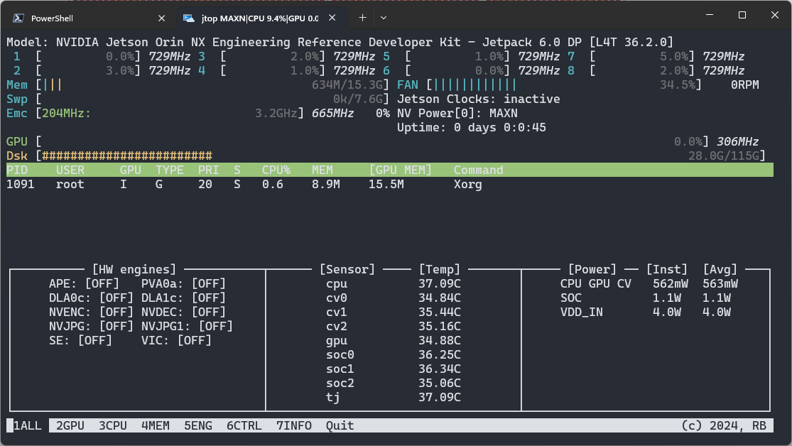
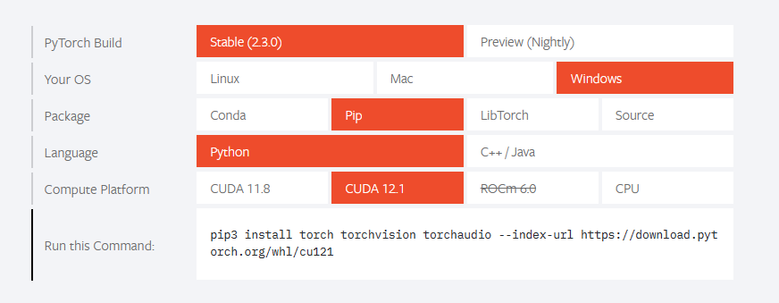
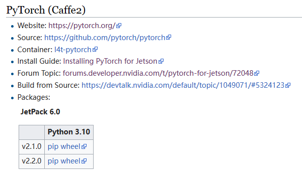
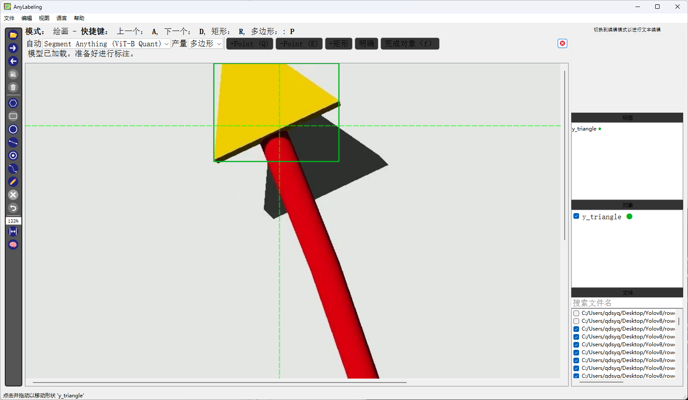
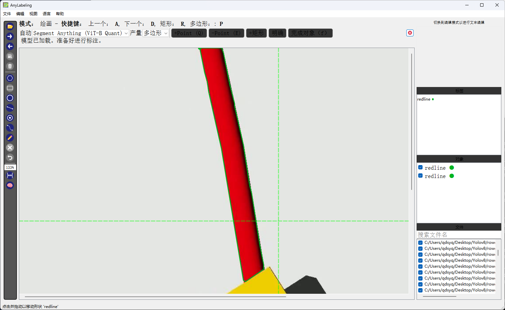
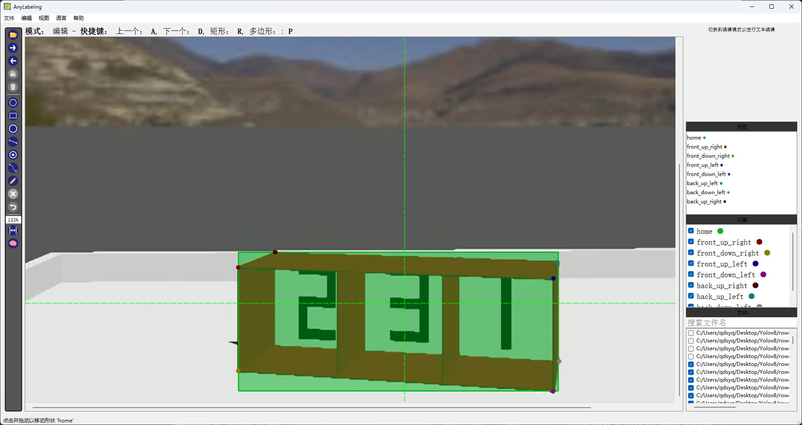

# YOLOv8 入门

## 0.环境

yolov8需要支持cuda的gpu和pytorch才能有效的工作。

### 0.0 cuda安装

**Windows**

通常情况下cuda会在安装nvidia显卡驱动时被安装，并不需要独立安装。可以通过在命令行下键入以下指令检查是否安装有cuda与cuda的版本：

```cmd
nvidia-smi
```

可得到以下结果：

```cmd
+-----------------------------------------------------------------------------------------+
| NVIDIA-SMI 552.22                 Driver Version: 552.22         CUDA Version: 12.4     |
|-----------------------------------------+------------------------+----------------------+
| GPU  Name                     TCC/WDDM  | Bus-Id          Disp.A | Volatile Uncorr. ECC |
| Fan  Temp   Perf          Pwr:Usage/Cap |           Memory-Usage | GPU-Util  Compute M. |
|                                         |                        |               MIG M. |
|=========================================+========================+======================|
|   0  NVIDIA GeForce RTX 4090 ...  WDDM  |   00000000:01:00.0  On |                  N/A |
| N/A   53C    P0             39W /  153W |    2262MiB /  16376MiB |     13%      Default |
|                                         |                        |                  N/A |
+-----------------------------------------+------------------------+----------------------+
```

笔者此处的cuda版本为12.4。

**jetson**

通过使用Nvidia的sdk-manager刷机的jetson系列产品在成功刷机后都会自带cuda。

刷机后初次使用，使用以下指令安装pip：

```shell
sudo apt install python3-pip
```

通过pip安装jtop（使用国内镜像加速）：

```shell
sudo -H pip3 install jetson-stats -i https://pypi.tuna.tsinghua.edu.cn/simple
```

重启后使用以下指令查看状态：

```shell
jtop
```

可以查看对应的jetpack版本：




### 0.1 pytorch安装

**windows**

在[pytorch官网](https://pytorch.org/)上查找对应版本安装：



安装完成后使用以下python代码测试是否安装完成：

```python
import torch
print(torch.cuda.is_available())
```

若打印结果为`True`即为安装成功。

**jetson**

在[jetson zoo](https://elinux.org/Jetson_Zoo#PyTorch_.28Caffe2.29)官网寻找pytorch安装包，选择与jetpack对应的版本下载：



下载后使用pip安装（使用国内镜像加速依赖下载）：

```shell
pip install ./torch-*.py -i https://pypi.tuna.tsinghua.edu.cn/simple
```

并使用以下命令为root用户安装：

```shell
sudo pip install ./torch-*.py -i https://pypi.tuna.tsinghua.edu.cn/simple
```

查找和当前版本pytorch对应的torchvision版本（可参考pytorch[github主页](https://github.com/pytorch/vision)），从github仓库拉取对应版本torchvision：

```shell
git clone --branch <版本号> https://github.com/pytorch/vision torchvision
```

在torchvision工程根目录下使用以下指令打包whl文件：

```shell
sudo python3 setup.py sdist bdist_wheel
```

进入dist目录找到whl文件，并安装：

```shell
pip install torchvision-*.whl
```


### 0.2 Yolov8 安装

使用pip安装：

```sh
pip install ultralytics
```


## 1. 目标检测 Detect

### 1.0 简单尝试

使用以下脚本即可使用`yolov8n`模型进行检测：

```python
import cv2
import torch


from ultralytics import YOLO
from cv2 import getTickCount, getTickFrequency


# 检查是否有可用的GPU
if torch.cuda.is_available():
    device = torch.device("cuda:0")
    print("Running on the GPU")
else:
    device = torch.device("cpu")
    print("Running on the CPU")

# 加载 YOLOv8 模型
model = YOLO("yolov8n.pt")
model.to(device)

# 获取摄像头内容，参数 0 表示使用默认的摄像头
cap = cv2.VideoCapture(0)

while cap.isOpened():
    loop_start = getTickCount()
    ret, frame = cap.read()  # 读取摄像头的一帧图像

    if ret:
        results = model.predict(source=frame)[0]  # 对当前帧进行目标检测并显示结果
    annotated_frame = results.plot()

    cv2.imshow("img", annotated_frame)

    if cv2.waitKey(1) & 0xFF == ord("q"):  # 通过按下 'q' 键退出循环
        break

cap.release()  # 释放摄像头资源
cv2.destroyAllWindows()  # 关闭OpenCV窗口
```

### 1.1 数据集制作

建议使用anylabeling实现半自动标注：

```python
pip install anylabeling
```



使用anylabeling会产生json格式的数据，需要使用python脚本转换为yolo格式的txt文件：

```python
JSON_DIR = r".\rowdata\sensors\row_datasets\json" # 原数据路径
SAVE_DIR = r".\rowdata\sensors\row_datasets\txt"  # txt数据储存路径
CLASSES = "y_square,y_triangle,b_square,end,tx"   # 目标类型列表


import json
import os
from tqdm import tqdm


def convert_label_json(json_dir: str, save_dir: str, classes: str):
    json_paths = os.listdir(json_dir)
    classes = classes.split(",")

    for json_path in tqdm(json_paths):
        # for json_path in json_paths:
        path = os.path.join(json_dir, json_path)
        with open(path, "r") as load_f:
            json_dict = json.load(load_f)
        h, w = json_dict["imageHeight"], json_dict["imageWidth"]

        # save txt path
        txt_path = os.path.join(save_dir, json_path.replace("json", "txt"))
        txt_file = open(txt_path, "w")

        for shape_dict in json_dict["shapes"]:
            if shape_dict["shape_type"] == "polygon":

                label = shape_dict["label"]
                label_index = classes.index(label)
                points = shape_dict["points"]

                points_nor_list = []

                for point in points:
                    points_nor_list.append(point[0] / w)
                    points_nor_list.append(point[1] / h)

                points_nor_list = list(map(lambda x: str(x), points_nor_list))
                points_nor_str = " ".join(points_nor_list)

                yolo_line = str(label_index) + " " + points_nor_str + "\n"
                txt_file.writelines(yolo_line)

            elif shape_dict["shape_type"] == "rectangle":
                label = shape_dict["label"]
                label_index = classes.index(label)
                points = shape_dict["points"]

                x1 = float(points[0][0])
                y1 = float(points[0][1])
                x2 = float(points[1][0])
                y2 = float(points[1][1])

                x_center = (x1 + x2) / 2.0 / w
                y_center = (y1 + y2) / 2.0 / h
                bbox_width = abs(x2 - x1) / w
                bbox_height = abs(y2 - y1) / h

                yolo_line = f"{label_index} {x_center:.6f} {y_center:.6f} {bbox_width:.6f} {bbox_height:.6f}\n"
                txt_file.writelines(yolo_line)


if __name__ == "__main__":
    convert_label_json(JSON_DIR, SAVE_DIR, CLASSES)
```

使用python脚本将图片和标注数据按比例切分为训练集、验证集和测试集：

```python
# 将图片和标注数据按比例切分为训练集、验证集和测试集
IMG_PATH = r".\rowdata\uuv_home\row_datasets\imgs" # 图像数据储存路径
TXT_DIR = r".\rowdata\uuv_home\row_datasets\txt"   # 标注数据储存路径
SAVE_DIR = r".\rowdata\uuv_home\uuv_home"          # 训练集、验证集和测试集数据储存路径

# 数据集划分比例，训练集比例与验证集比例，剩余为测试集
TRAIN_PERCENT = 0.75 # 训练集比例
VAL_PERCENT = 0.15   # 验证集比例


import shutil
import random
import os
import argparse


# 检查文件夹是否存在
def mkdir(path):
    if not os.path.exists(path):
        os.makedirs(path)


def main(image_dir, txt_dir, save_dir):
    # 创建文件夹
    mkdir(save_dir)
    images_dir = os.path.join(save_dir, "images")
    labels_dir = os.path.join(save_dir, "labels")

    img_train_path = os.path.join(images_dir, "train")
    img_test_path = os.path.join(images_dir, "test")
    img_val_path = os.path.join(images_dir, "val")

    label_train_path = os.path.join(labels_dir, "train")
    label_test_path = os.path.join(labels_dir, "test")
    label_val_path = os.path.join(labels_dir, "val")

    mkdir(images_dir)
    mkdir(labels_dir)
    mkdir(img_train_path)
    mkdir(img_test_path)
    mkdir(img_val_path)
    mkdir(label_train_path)
    mkdir(label_test_path)
    mkdir(label_val_path)

    test_percent = 0

    total_txt = os.listdir(txt_dir)
    num_txt = len(total_txt)
    list_all_txt = range(num_txt)  # 范围 range(0, num)

    num_train = int(num_txt * TRAIN_PERCENT)
    num_val = int(num_txt * VAL_PERCENT)
    num_test = num_txt - num_train - num_val

    train = random.sample(list_all_txt, num_train)
    # 在全部数据集中取出train
    val_test = [i for i in list_all_txt if not i in train]
    # 再从val_test取出num_val个元素，val_test剩下的元素就是test
    val = random.sample(val_test, num_val)

    print(
        "训练集数目：{}, 验证集数目：{},测试集数目：{}".format(
            len(train), len(val), len(val_test) - len(val)
        )
    )
    for i in list_all_txt:
        name = total_txt[i][:-4]

        srcImage = os.path.join(image_dir, name + ".jpg")
        srcLabel = os.path.join(txt_dir, name + ".txt")

        if i in train:
            dst_train_Image = os.path.join(img_train_path, name + ".jpg")
            dst_train_Label = os.path.join(label_train_path, name + ".txt")
            shutil.copyfile(srcImage, dst_train_Image)
            shutil.copyfile(srcLabel, dst_train_Label)
        elif i in val:
            dst_val_Image = os.path.join(img_val_path, name + ".jpg")
            dst_val_Label = os.path.join(label_val_path, name + ".txt")
            shutil.copyfile(srcImage, dst_val_Image)
            shutil.copyfile(srcLabel, dst_val_Label)
        else:
            dst_test_Image = os.path.join(img_test_path, name + ".jpg")
            dst_test_Label = os.path.join(label_test_path, name + ".txt")
            shutil.copyfile(srcImage, dst_test_Image)
            shutil.copyfile(srcLabel, dst_test_Label)


if __name__ == "__main__":
    main(IMG_PATH, TXT_DIR, SAVE_DIR)
```


### 1.2 模型训练

创建yaml格式的数据集描述文件：

```yaml
# 数据集根目录
path: ./rowdata/sensors/sensors

# 数据集分割
train: images/train
val: images/train
test: images/train

# 类别名
names:
  0: y_square
  1: y_triangle
  2: b_squar
  3: end
  4: tx

# 类别数
nc: 5
```

创建yaml格式的模型描述文件：

```yaml
# Ultralytics YOLO 🚀, AGPL-3.0 license
# YOLOv8 object detection model with P3-P5 outputs. For Usage examples see https://docs.ultralytics.com/tasks/detect

# Parameters
nc: 5 # 类别数
scales: # model compound scaling constants, i.e. 'model=yolov8n.yaml' will call yolov8.yaml with scale 'n'
  # [depth, width, max_channels]
  n: [0.33, 0.25, 1024] # YOLOv8n summary: 225 layers,  3157200 parameters,  3157184 gradients,   8.9 GFLOPs
  s: [0.33, 0.50, 1024] # YOLOv8s summary: 225 layers, 11166560 parameters, 11166544 gradients,  28.8 GFLOPs
  m: [0.67, 0.75, 768] # YOLOv8m summary: 295 layers, 25902640 parameters, 25902624 gradients,  79.3 GFLOPs
  l: [1.00, 1.00, 512] # YOLOv8l summary: 365 layers, 43691520 parameters, 43691504 gradients, 165.7 GFLOPs
  x: [1.00, 1.25, 512] # YOLOv8x summary: 365 layers, 68229648 parameters, 68229632 gradients, 258.5 GFLOPs

# YOLOv8.0n backbone
backbone:
  # [from, repeats, module, args]
  - [-1, 1, Conv, [64, 3, 2]] # 0-P1/2
  - [-1, 1, Conv, [128, 3, 2]] # 1-P2/4
  - [-1, 3, C2f, [128, True]]
  - [-1, 1, Conv, [256, 3, 2]] # 3-P3/8
  - [-1, 6, C2f, [256, True]]
  - [-1, 1, Conv, [512, 3, 2]] # 5-P4/16
  - [-1, 6, C2f, [512, True]]
  - [-1, 1, Conv, [1024, 3, 2]] # 7-P5/32
  - [-1, 3, C2f, [1024, True]]
  - [-1, 1, SPPF, [1024, 5]] # 9

# YOLOv8.0n head
head:
  - [-1, 1, nn.Upsample, [None, 2, "nearest"]]
  - [[-1, 6], 1, Concat, [1]] # cat backbone P4
  - [-1, 3, C2f, [512]] # 12

  - [-1, 1, nn.Upsample, [None, 2, "nearest"]]
  - [[-1, 4], 1, Concat, [1]] # cat backbone P3
  - [-1, 3, C2f, [256]] # 15 (P3/8-small)

  - [-1, 1, Conv, [256, 3, 2]]
  - [[-1, 12], 1, Concat, [1]] # cat head P4
  - [-1, 3, C2f, [512]] # 18 (P4/16-medium)

  - [-1, 1, Conv, [512, 3, 2]]
  - [[-1, 9], 1, Concat, [1]] # cat head P5
  - [-1, 3, C2f, [1024]] # 21 (P5/32-large)

  - [[15, 18, 21], 1, Detect, [nc]] # Detect(P3, P4, P5)
```

编写python脚本训练：

```python
DATASET_YAML_PATH = r".\datasets\sensors.yaml"
MODEL_YAML_PATH = r".\models\sensors.yaml"

SIZE = 640    # 输入图像大小 SIZE*SIZE
EPOCHS = 100  # 训练次数

import torch

from ultralytics import YOLO

# 检查是否有可用的GPU
if torch.cuda.is_available():
    device = torch.device("cuda:0")
    print("Running on the GPU")
else:
    device = torch.device("cpu")
    print("Running on the CPU")


# 构建模型
model = YOLO(MODEL_YAML_PATH)

model.to(device) # 加载模型至GPU
model.load("weights/yolov8n.pt")  # 加载预训练模型


if __name__ == "__main__":
    # 训练模型
    results = model.train(data=DATASET_YAML_PATH, epochs=EPOCHS, imgsz=SIZE)
	# 测试模型
    metrics = model.val()
```


### 1.3 模型预测

加载模型并使用gpu实现模型的预测：

```python
import torch
from ultralytics import YOLO

# 检查是否有可用的GPU
if torch.cuda.is_available():
    device = torch.device("cuda:0")
    print("Running on the GPU")
else:
    device = torch.device("cpu")
    print("Running on the CPU")

# 加载 YOLOv8 模型
model = YOLO("weights/sensors.pt")
model.to(device)
```

从模型中提取目标名称列表：

```python
name_list = model.names
```

使用`model.predict(source=frame)[0]`对当前帧进行预测：

```python
result = model.predict(source=frame)[0]
```

以numpy数组的形式提取预测结果：

```py
if result.boxes is not None:
    targets = result.boxes.data.cpu().numpy()
```

这将会获取一个由6维向量构成的数组，可从中提取目标名称：

```python
for t in targets:
    name = name_list[int(t[5])]
```

可从中提取目标可信度：

```python
for t in targets:
    conf = float(t[4])
```

可从中提取目标框的一对对角点的X与Y坐标：

```python
for t in targets:
    box_xyxy =t[:4]
```


## 2. 图形分割 Segment

### 2.0 简单尝试

使用以下脚本即可使用`yolov8n-seg`模型进行检测：

 ```python
 import cv2
 import torch
 
 
 from ultralytics import YOLO
 from cv2 import getTickCount, getTickFrequency
 
 
 # 检查是否有可用的GPU
 if torch.cuda.is_available():
     device = torch.device("cuda:0")
     print("Running on the GPU")
 else:
     device = torch.device("cpu")
     print("Running on the CPU")
 
 # 加载 YOLOv8 模型
 model = YOLO("yolov8n-seg.pt")
 model.to(device)
 
 # 获取摄像头内容，参数 0 表示使用默认的摄像头
 cap = cv2.VideoCapture(0)
 
 while cap.isOpened():
     loop_start = getTickCount()
     ret, frame = cap.read()  # 读取摄像头的一帧图像
 
     if ret:
         results = model.predict(source=frame)[0]  # 对当前帧进行目标检测并显示结果
     annotated_frame = results.plot()
 
     cv2.imshow("img", annotated_frame)
 
     if cv2.waitKey(1) & 0xFF == ord("q"):  # 通过按下 'q' 键退出循环
         break
 
 cap.release()  # 释放摄像头资源
 cv2.destroyAllWindows()  # 关闭OpenCV窗口
 ```


### 2.1 数据集制作

建议使用anylabeling实现半自动标注：

```python
pip install anylabeling
```



anylabeling 会产生json格式的文件，需要使用python脚本将其转换为yolo的txt格式的标注数据，脚本可使用  **1.1数据集制作** 中的转换脚本。

使用 **1.1数据集制作** 中的python划分脚本划分此处的数据集。


### 2.2 模型训练

创建yaml格式的数据集描述文件：

```yaml
# 数据集根目录
path: ./rowdata/redline/redline

# 数据集分割
train: images/train
val: images/val
test: images/test

# 类别
names:
  0: redline
```

创建yaml格式的模型描述文件：

```yaml
# Ultralytics YOLO 🚀, AGPL-3.0 license
# YOLOv8-seg instance segmentation model. For Usage examples see https://docs.ultralytics.com/tasks/segment
 
# Parameters
nc: 1  # 类别数
scales: # model compound scaling constants, i.e. 'model=yolov8n-seg.yaml' will call yolov8-seg.yaml with scale 'n'
  # [depth, width, max_channels]
  n: [0.33, 0.25, 1024]
  s: [0.33, 0.50, 1024]
  m: [0.67, 0.75, 768]
  l: [1.00, 1.00, 512]
  x: [1.00, 1.25, 512]
 
# YOLOv8.0n backbone
backbone:
  # [from, repeats, module, args]
  - [-1, 1, Conv, [64, 3, 2]]  # 0-P1/2
  - [-1, 1, Conv, [128, 3, 2]]  # 1-P2/4
  - [-1, 3, C2f, [128, True]]
  - [-1, 1, Conv, [256, 3, 2]]  # 3-P3/8
  - [-1, 6, C2f, [256, True]]
  - [-1, 1, Conv, [512, 3, 2]]  # 5-P4/16
  - [-1, 6, C2f, [512, True]]
  - [-1, 1, Conv, [1024, 3, 2]]  # 7-P5/32
  - [-1, 3, C2f, [1024, True]]
  - [-1, 1, SPPF, [1024, 5]]  # 9
 
# YOLOv8.0n head
head:
  - [-1, 1, nn.Upsample, [None, 2, 'nearest']]
  - [[-1, 6], 1, Concat, [1]]  # cat backbone P4
  - [-1, 3, C2f, [512]]  # 12
 
  - [-1, 1, nn.Upsample, [None, 2, 'nearest']]
  - [[-1, 4], 1, Concat, [1]]  # cat backbone P3
  - [-1, 3, C2f, [256]]  # 15 (P3/8-small)
 
  - [-1, 1, Conv, [256, 3, 2]]
  - [[-1, 12], 1, Concat, [1]]  # cat head P4
  - [-1, 3, C2f, [512]]  # 18 (P4/16-medium)
 
  - [-1, 1, Conv, [512, 3, 2]]
  - [[-1, 9], 1, Concat, [1]]  # cat head P5
  - [-1, 3, C2f, [1024]]  # 21 (P5/32-large)
 
  - [[15, 18, 21], 1, Segment, [nc, 32, 256]]  # Segment(P3, P4, P5)
```

编写python脚本进行训练：

```python
DATASET_YAML_PATH = r".\datasets\redlines.yaml"
MODEL_YAML_PATH = r".\models\redlines.yaml"

SIZE = 640    # 输入图像大小 SIZE*SIZE
EPOCHS = 100  # 训练次数

import torch

from ultralytics import YOLO

# 检查是否有可用的GPU
if torch.cuda.is_available():
    device = torch.device("cuda:0")
    print("Running on the GPU")
else:
    device = torch.device("cpu")
    print("Running on the CPU")


# 构建模型
model = YOLO(MODEL_YAML_PATH)

model.to(device) # 加载模型至GPU
model.load("weights/yolov8n-seg.pt")  # 加载预训练模型


if __name__ == "__main__":
    # 训练模型
    results = model.train(data=DATASET_YAML_PATH, epochs=EPOCHS, imgsz=SIZE)
	# 测试模型
    metrics = model.val()
```


### 2.3 模型预测

加载模型并使用gpu实现模型的预测：

```python
import torch
from ultralytics import YOLO

# 检查是否有可用的GPU
if torch.cuda.is_available():
    device = torch.device("cuda:0")
    print("Running on the GPU")
else:
    device = torch.device("cpu")
    print("Running on the CPU")

# 加载 YOLOv8 模型
model = YOLO("weights/sensors.pt")
model.to(device)
```

使用`model.predict(source=frame)[0]`对当前帧进行预测：

```python
result = model.predict(source=frame)[0]
```

以numpy的格式提取图像中的掩膜：

```python
if result.masks is not None:
    # load mask from predict resault
    mask_raw = result.masks[0].cpu().data.numpy().transpose(1, 2, 0)
    for mask_raw in result.masks:
        mask_raw += mask_raw.cpu().data.numpy().transpose(1, 2, 0)
```

此处需要转置掩膜矩阵以获取cv2格式的numpy矩阵。

变换掩膜大小，以匹配原图像，同时转换数据格式为`numpy.int32`以方便后续处理：

```python
mask = cv2.resize(mask_raw, size, interpolation=cv2.INTER_LINEAR).astype(
    np.int32
)
```

这样就获取了一份和原图相同大小的掩膜，该掩膜为yolov8对目标图形进行图形分割的结果。


## 3. 关键点检测 Pose

### 3.0 简单尝试

使用以下脚本即可使用`yolov8n-pose模型进行检测：

 ```python
import cv2
import torch


from ultralytics import YOLO
from cv2 import getTickCount, getTickFrequency


# 检查是否有可用的GPU
if torch.cuda.is_available():
    device = torch.device("cuda:0")
    print("Running on the GPU")
else:
    device = torch.device("cpu")
    print("Running on the CPU")

# 加载 YOLOv8 模型
model = YOLO("yolov8n-pose.pt")
model.to(device)

# 获取摄像头内容，参数 0 表示使用默认的摄像头
cap = cv2.VideoCapture(0)

while cap.isOpened():
    loop_start = getTickCount()
    ret, frame = cap.read()  # 读取摄像头的一帧图像

    if ret:
        results = model.predict(source=frame)[0]  # 对当前帧进行目标检测并显示结果
    annotated_frame = results.plot()

    cv2.imshow("img", annotated_frame)

    if cv2.waitKey(1) & 0xFF == ord("q"):  # 通过按下 'q' 键退出循环
        break

cap.release()  # 释放摄像头资源
cv2.destroyAllWindows()  # 关闭OpenCV窗口
 ```


### 3.1 制作数据集

为保持和上文同一，使用anylabeling标注，



可以先使用半自动标注功能先将目标框出，再按序标点。

使用python脚本将json格式的标注数据转换为yolo格式的txt标注数据：

```python
JSON_DIR = r".\rowdata\uuv_home\row_datasets\json"# 原数据路径
SAVE_DIR = r".\rowdata\uuv_home\row_datasets\txt" # txt数据储存路径
CLASS_NAME = "home" # 目标名
PIONTS_LIST = "front_up_right,front_up_left,front_down_right,front_down_left,back_up_right,back_up_left,back_down_right,back_down_left" # 关键点列表

import json
import os
from tqdm import tqdm


def get_point(name, shapes) -> dict:
    for shape in shapes:
        if shape["label"] == name:
            return shape
    return None


def convert_label_json(json_dir: str, save_dir: str, class_name: str, points: str):
    json_paths = os.listdir(json_dir)

    points = points.split(",")

    for json_path in tqdm(json_paths):
        # for json_path in json_paths:
        path = os.path.join(json_dir, json_path)
        with open(path, "r") as load_f:
            json_dict = json.load(load_f)
        h, w = json_dict["imageHeight"], json_dict["imageWidth"]

        # save txt path
        txt_path = os.path.join(save_dir, json_path.replace("json", "txt"))
        txt_file = open(txt_path, "w")

        yolo_line = "0 "

        main_box = get_point(class_name, json_dict["shapes"])

        x1 = float(main_box["points"][0][0])
        y1 = float(main_box["points"][0][1])
        x2 = float(main_box["points"][1][0])
        y2 = float(main_box["points"][1][1])

        x_center = (x1 + x2) / 2.0 / w
        y_center = (y1 + y2) / 2.0 / h
        box_w = abs(x2 - x1) / w
        box_h = abs(y2 - y1) / h

        yolo_line += f"{x_center:.6f} {y_center:.6f} {box_w:.6f} {box_h:.6f} "

        for point_name in points:
            point = get_point(point_name, json_dict["shapes"])

            if point is None:
                yolo_line += "0 0 0 "

            else:
                p_x = point["points"][0][0] / w
                p_y = point["points"][0][1] / h
                yolo_line += f"{p_x:.6f} {p_y:.6f} 1 "

        txt_file.writelines(yolo_line)


if __name__ == "__main__":
    convert_label_json(JSON_DIR, SAVE_DIR, CLASS_NAME, PIONTS_LIST)
```

使用 **1.1数据集制作** 中的python划分脚本划分此处的数据集。

### 3.2 模型训练

创建yaml格式的数据集描述文件：

```yaml
path: ./rowdata/uuv_home/uuv_home
train: images/train # train images
val: images/train # val images
test: images/train # test images (optional)

# 关键点
kpt_shape: [8, 3] # [关键点数量,关键点坐标维数(2 : x,y | 3 : x,y,visible)]
# flip_idx:  # 对称映射 (可选)

# 目标列表
names:
  0: uuv_home
```

创建yaml格式的模型描述文件：

```yaml
# Ultralytics YOLO 🚀, AGPL-3.0 license
# YOLOv8-pose keypoints/pose estimation model. For Usage examples see https://docs.ultralytics.com/tasks/pose

# Parameters
nc: 1 # 类别数
kpt_shape: [8, 3] # [关键点数量,关键点坐标维数(2 : x,y | 3 : x,y,visible)]
scales: # model compound scaling constants, i.e. 'model=yolov8n-pose.yaml' will call yolov8-pose.yaml with scale 'n'
  # [depth, width, max_channels]
  n: [0.33, 0.25, 1024]
  s: [0.33, 0.50, 1024]
  m: [0.67, 0.75, 768]
  l: [1.00, 1.00, 512]
  x: [1.00, 1.25, 512]

# YOLOv8.0n backbone
backbone:
  # [from, repeats, module, args]
  - [-1, 1, Conv, [64, 3, 2]] # 0-P1/2
  - [-1, 1, Conv, [128, 3, 2]] # 1-P2/4
  - [-1, 3, C2f, [128, True]]
  - [-1, 1, Conv, [256, 3, 2]] # 3-P3/8
  - [-1, 6, C2f, [256, True]]
  - [-1, 1, Conv, [512, 3, 2]] # 5-P4/16
  - [-1, 6, C2f, [512, True]]
  - [-1, 1, Conv, [1024, 3, 2]] # 7-P5/32
  - [-1, 3, C2f, [1024, True]]
  - [-1, 1, SPPF, [1024, 5]] # 9

# YOLOv8.0n head
head:
  - [-1, 1, nn.Upsample, [None, 2, "nearest"]]
  - [[-1, 6], 1, Concat, [1]] # cat backbone P4
  - [-1, 3, C2f, [512]] # 12

  - [-1, 1, nn.Upsample, [None, 2, "nearest"]]
  - [[-1, 4], 1, Concat, [1]] # cat backbone P3
  - [-1, 3, C2f, [256]] # 15 (P3/8-small)

  - [-1, 1, Conv, [256, 3, 2]]
  - [[-1, 12], 1, Concat, [1]] # cat head P4
  - [-1, 3, C2f, [512]] # 18 (P4/16-medium)

  - [-1, 1, Conv, [512, 3, 2]]
  - [[-1, 9], 1, Concat, [1]] # cat head P5
  - [-1, 3, C2f, [1024]] # 21 (P5/32-large)

  - [[15, 18, 21], 1, Pose, [nc, kpt_shape]] # Pose(P3, P4, P5)
```

编写python脚本进行训练：

```python
DATASET_YAML_PATH = r".\datasets\uuv_home.yaml"
MODEL_YAML_PATH = r".\models\yolov8n-pose.yaml"

SIZE = 640
EPOCHS = 2000

import torch

from ultralytics import YOLO

# 检查是否有可用的GPU
if torch.cuda.is_available():
    device = torch.device("cuda:0")
    print("Running on the GPU")
else:
    device = torch.device("cpu")
    print("Running on the CPU")


# 构建模型
model = YOLO(MODEL_YAML_PATH)

model.to(device)
model.load("weights/yolov8n-pose.pt")  # 加载预训练模型


if __name__ == "__main__":
    # 训练模型
    results = model.train(data=DATASET_YAML_PATH, epochs=EPOCHS, imgsz=SIZE)

    metrics = model.val()
```


### 3.3 模型预测

加载模型并使用gpu实现模型的预测：

```python
import torch
from ultralytics import YOLO

# 检查是否有可用的GPU
if torch.cuda.is_available():
    device = torch.device("cuda:0")
    print("Running on the GPU")
else:
    device = torch.device("cpu")
    print("Running on the CPU")

# 加载 YOLOv8 模型
model = YOLO(r".\weights\uuv_home_pose.pt")
model.to(device)
```

使用`model.predict(source=frame)[0]`对当前帧进行预测：

```python
result = model.predict(source=frame)[0]
```

以numpy的格式提取模型预测结果：

```python
if result.keypoints is not None:
    keypoints = result.keypoints.cpu().data.numpy()[0]
```

该结果为一个由n*3的numpy矩阵，是一个由n个描述关键点位置与可见性的向量按预设顺序组成的列表：

可按照以下方法逐个再图像中标出：

```python
for point in keypoints:
    if point[2] > KEYPOINT_SCORE:
        cv2.circle(img,point[0:2].astype(np.int32),3,(0, 255, 0),3,)
```


